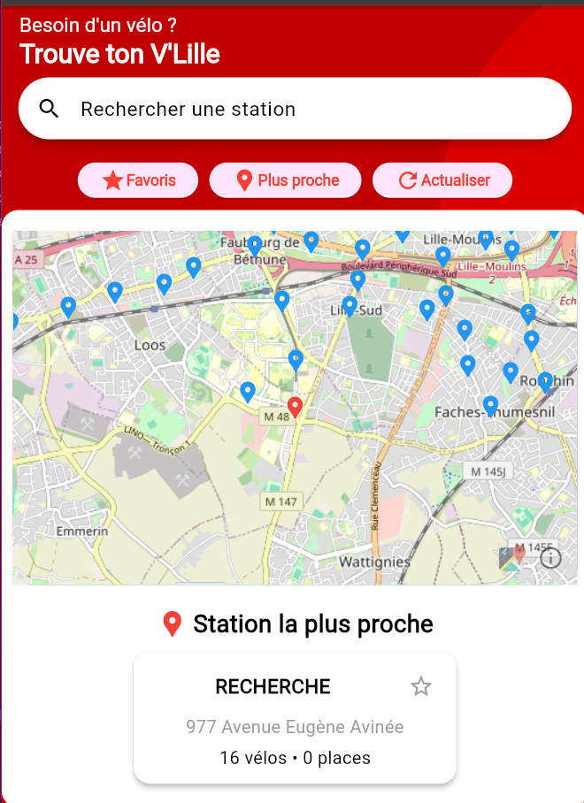
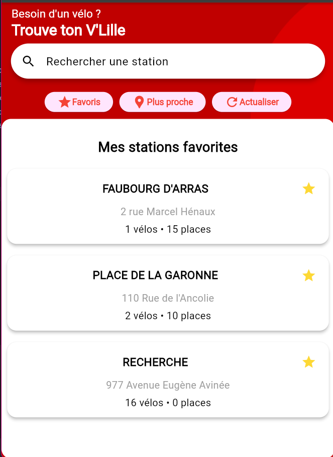

# V'Lille Finder App

## Overview
**V'Lille Finder** is a Flutter application designed to help users find the nearest V'Lille bike-sharing stations. The app allows users to search for stations, mark favorites, and view real-time station details, such as available bikes and parking slots. The app also provides an interactive map with station markers and smooth animations for a seamless user experience.

## Features
- **Search for V'Lille stations:** Users can search for stations by name.
- **Find the nearest station:** Automatically displays the closest station based on the user's location.
- **Favorites list:** Users can add stations to a favorites list for quick access.
- **Interactive Map:** Shows station locations on a map, with clickable markers to focus on specific stations.
- **Real-time station information:** Displays live data such as the number of available bikes and parking spaces.

## Screenshots



## Getting Started

### Prerequisites
To run the app, you'll need:
- [Flutter SDK](https://flutter.dev/docs/get-started/install)
- Android Studio or Visual Studio Code (with Flutter and Dart plugins)
- A connected Android/iOS device or emulator

### Installation
1. Clone the repository:
    ```bash
    git clone https://github.com/chloclicot/vlille-finder.git
    cd vlille-finder
    ```

2. Install dependencies:
    ```bash
    flutter pub get
    ```

3. Run the app on your device/emulator:
    ```bash
    flutter run
    ```

## Code Structure
The app follows a clean and modular architecture with a focus on separation of concerns.

- **Main:** The entry point of the app is `main.dart`. It initializes the app with a theme and sets up navigation.

- **State Management:** The app uses `Provider` for state management. The `StationsProvider` is used to manage and provide the list of stations, selected station, and closest station.

- **UI Widgets:**
    - **HomeScreen:** Displays the search bar, buttons for the map and favorites, and the closest station.
    - **StationWidget:** Represents individual stations in a list.
    - **MapScreen:** Displays the map with markers for each station.

- **Map Integration:** The app uses `flutter_map` package for rendering interactive maps and managing marker layers.

## Technologies Used
- **Flutter**: For building the app UI.
- **Provider**: State management solution for keeping track of stations and favorites.
- **flutter_map**: For rendering the map and placing interactive markers.
- **OpenStreetMap**: As the tile layer for the map.
- **V'Lille API**: To fetch real-time station data (number of bikes, parking spots, etc.).

## How to Use the App

1. **Search Station:** Use the search bar to look for a specific station by its name.
2. **View on Map:** Click on the "Map" button to open the interactive map with station markers.
3. **Favorites:** Add stations to your favorites by clicking the star icon. Access the favorites list by clicking the "Favorites" button.
4. **Closest Station:** The app automatically detects your location and displays the nearest station with real-time information.


## Future Enhancements
- Add support for user authentication to save favorites across devices.
- Implement push notifications for station availability updates.
- Responsive design
- make the app prettier

---

Made by [Chloé varin](https://github.com/chloclicot)
